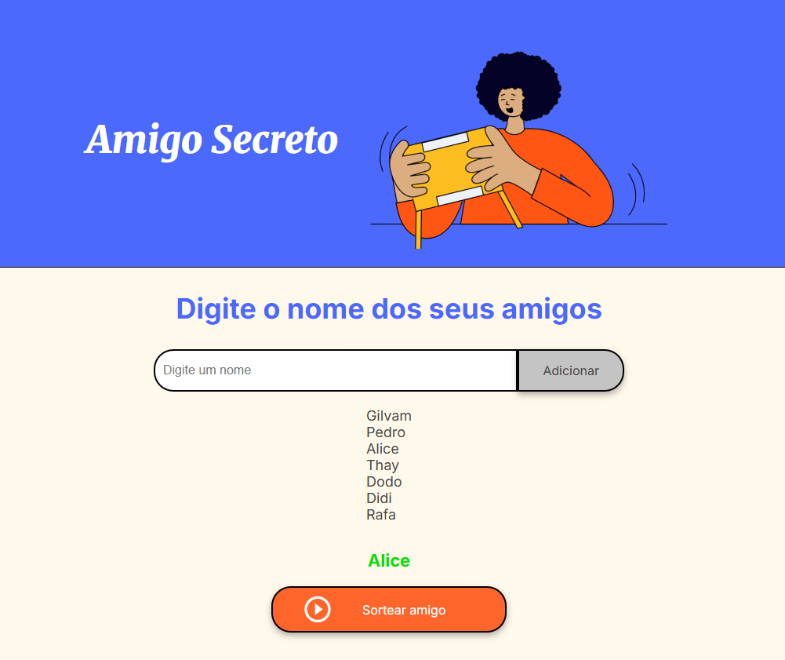

# 🎁 Amigo Secreto - Sorteador Simples

Este projeto web simples em HTML, CSS e JavaScript foi realizado como parte do desafio do Projeto One da Oracle, com o objetivo de consolidar o aprendizado e aplicar conhecimentos adquiridos durante o curso.

Ele permite cadastrar nomes e sortear um amigo secreto aleatório a partir da lista, sendo ideal para brincadeiras rápidas ou fins educacionais.

---

## 🧩 Funcionalidades Implementadas

- ✅ Cadastro de nomes com validação (sem campos vazios ou repetidos)
- ✅ Exibição dinâmica da lista de participantes
- ✅ Sorteio de um único nome aleatório da lista (modo simples)
- ✅ Resultado exibido na tela
- ✅ Interface organizada e responsiva

---

## 📸 Captura de Tela



---

## 🚀 Tecnologias Utilizadas

- HTML5  
- CSS3  
- JavaScript  

---

## 📂 Estrutura do Projeto

```plaintext
amigo-secreto/
├── index.html
├── app.js
├── style.css
└── assets/
    ├── Screenshot.png
    ├── amigo-secreto.png
    └── play_circle_outline.png
```

---

## ⚙️ Como Executar Localmente

1. Clone o repositório:
   ```bash
   git clone https://github.com/gilvamgomes/3-Praticando-Logica-de-programa--o-Challenge-amigo-secreto.git
   ```
2. Abra o arquivo `index.html` no navegador:

   - Clique duas vezes no arquivo, ou
   
   - Use uma extensão como o Live Server (no VSCode).
   

